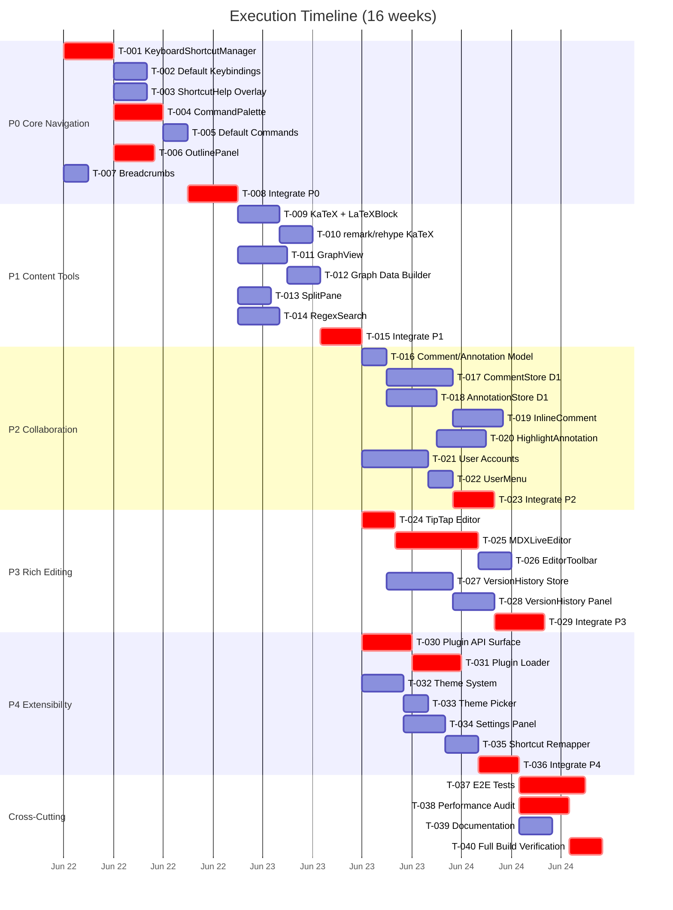

# Dependency Graph — VS Code for Content Execution Plan

**Version:** 2.0.0 | **Date:** 2026-06-19 | **Tasks:** 42

## Full Dependency Graph

```mermaid
graph TD
    subgraph P0["P0: Core Navigation Shell (Wk 1-2)"]
        T001["T-001<br/>KeyboardShortcutManager<br/><b>CRITICAL</b>"]
        T002["T-002<br/>Default Keybindings"]
        T003["T-003<br/>ShortcutHelp Overlay"]
        T004["T-004<br/>CommandPalette<br/><b>CRITICAL</b>"]
        T005["T-005<br/>Default Commands"]
        T006["T-006<br/>OutlinePanel<br/><b>CRITICAL</b>"]
        T007["T-007<br/>Breadcrumbs"]
        T008["T-008<br/>Integrate P0<br/><b>CRITICAL</b>"]
    end

    subgraph P1["P1: Content Tools (Wk 3-4)"]
        T009["T-009<br/>KaTeX + LaTeXBlock"]
        T010["T-010<br/>remark/rehype KaTeX"]
        T011["T-011<br/>GraphView<br/>force-graph"]
        T012["T-012<br/>Graph Data Builder"]
        T013["T-013<br/>SplitPane"]
        T014["T-014<br/>RegexSearch"]
        T015["T-015<br/>Integrate P1"]
    end

    subgraph P2["P2: Collaboration (Wk 5-8)"]
        T016["T-016<br/>Comment/Annotation<br/>Data Model"]
        T017["T-017<br/>CommentStore<br/>D1 Backend"]
        T018["T-018<br/>AnnotationStore<br/>D1 Backend"]
        T019["T-019<br/>InlineComment<br/>Component"]
        T020["T-020<br/>HighlightAnnotation<br/>Component"]
        T021["T-021<br/>User Accounts<br/>CF Access"]
        T022["T-022<br/>UserMenu<br/>Avatar"]
        T023["T-023<br/>Integrate P2"]
    end

    subgraph P3["P3: Rich Editing (Wk 9-12)"]
        T024["T-024<br/>TipTap Editor<br/>⚠ HIGH RISK"]
        T025["T-025<br/>MDXLiveEditor<br/>⚠ HIGH RISK"]
        T026["T-026<br/>EditorToolbar"]
        T027["T-027<br/>VersionHistory<br/>Store"]
        T028["T-028<br/>VersionHistory<br/>Panel"]
        T029["T-029<br/>Integrate P3"]
    end

    subgraph P4["P4: Extensibility (Wk 13-16)"]
        T030["T-030<br/>Plugin API Surface<br/>⚠ HIGH RISK"]
        T031["T-031<br/>Plugin Loader<br/>⚠ HIGH RISK"]
        T032["T-032<br/>Theme System"]
        T033["T-033<br/>Theme Picker"]
        T034["T-034<br/>Settings Panel"]
        T035["T-035<br/>Shortcut Remapper"]
        T036["T-036<br/>Integrate P4"]
    end

    subgraph X["Cross-Cutting"]
        T037["T-037<br/>E2E Tests"]
        T038["T-038<br/>Performance Audit"]
        T039["T-039<br/>Documentation"]
        T040["T-040<br/>Full Build<br/>Verification<br/><b>CRITICAL</b>"]
    end

    %% P0 Dependencies
    T001 --> T002
    T001 --> T003
    T001 --> T004
    T001 --> T006
    T002 --> T008
    T003 --> T008
    T004 --> T005
    T004 --> T008
    T005 --> T008
    T006 --> T008
    T007 --> T008

    %% P0 → P1
    T008 --> T015

    %% P1 Dependencies
    T009 --> T010
    T009 --> T015
    T010 --> T015
    T011 --> T012
    T011 --> T015
    T012 --> T015
    T013 --> T015
    T014 --> T015

    %% P1 → P2/P3/P4
    T015 --> T029
    T015 --> T036
    T015 --> T037

    %% P2 Dependencies
    T016 --> T017
    T016 --> T018
    T016 --> T027
    T017 --> T019
    T017 --> T023
    T018 --> T020
    T018 --> T023
    T019 --> T023
    T020 --> T023
    T021 --> T022
    T021 --> T023
    T022 --> T023

    %% P2 → P3/P4
    T023 --> T029
    T023 --> T036
    T023 --> T037

    %% P3 Dependencies
    T024 --> T025
    T025 --> T026
    T025 --> T029
    T026 --> T029
    T027 --> T028
    T027 --> T029
    T028 --> T029

    %% P3 → P4
    T029 --> T036
    T029 --> T037

    %% P4 Dependencies
    T030 --> T031
    T031 --> T036
    T032 --> T033
    T032 --> T034
    T033 --> T036
    T034 --> T035
    T034 --> T036
    T035 --> T036

    %% Cross-cutting
    T036 --> T037
    T036 --> T038
    T036 --> T039
    T036 --> T040
    T037 --> T040
    T038 --> T040
    T039 --> T040

    %% Styling
    classDef critical fill:#dc2626,color:#fff,stroke:#991b1b
    classDef high fill:#f59e0b,color:#000,stroke:#d97706
    classDef risk fill:#fbbf24,color:#000,stroke:#f59e0b,stroke-dasharray:5 5
    classDef integration fill:#8b5cf6,color:#fff,stroke:#7c3aed

    class T001,T004,T006,T008,T040 critical
    class T002,T003,T005,T007,T009,T010,T011,T012,T017,T018,T021,T024,T025,T027,T030,T031,T037,T038 high
    class T024,T025,T030,T031 risk
    class T015,T023,T029,T036 integration
```

## Critical Path

## Parallel Execution Tracks

## Risk Heatmap

| Task | Risk | Impact | Mitigation |
|------|------|--------|------------|
| T-024 (TipTap) | **HIGH** | Editor feature blocked | Fallback: CodeMirror 6 |
| T-025 (MDXLiveEditor) | **HIGH** | Rich editing blocked | Fallback: CodeMirror 6 |
| T-030 (Plugin API) | **HIGH** | Extensibility blocked | Simplify to hook-only API |
| T-031 (Plugin Loader) | **HIGH** | Plugin loading fails | Use dynamic import only |
| T-008 (Integrate P0) | **MEDIUM** | Layout conflicts | Incremental integration |
| T-015 (Integrate P1) | **MEDIUM** | Feature conflicts | Feature flags per component |
| T-017 (CommentStore) | **MEDIUM** | D1 latency | Optimistic updates + cache |
| T-018 (AnnotationStore) | **MEDIUM** | D1 latency | Optimistic updates + cache |
| T-021 (User Accounts) | **MEDIUM** | CF Access setup | Staging environment first |
| T-027 (VersionHistory) | **MEDIUM** | Diff performance | Line-level, not character |
| T-038 (Performance) | **MEDIUM** | Bundle bloat | Lazy loading mandatory |
