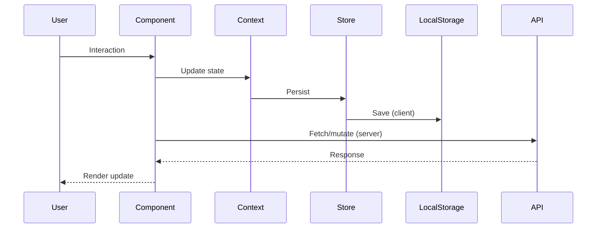

# Wikipept Architecture

## Overview

Wikipept is a monorepo for a collaborative oligopeptide learning platform. It uses Astro with SolidJS for interactive components, Tailwind CSS v4 for styling, and Cloudflare Workers for deployment.

## Package Structure

```
wikisites/
├── packages/
│   ├── wiki/          # Main Astro site (pages, components, themes)
│   ├── shared/        # Shared utilities (i18n, theme presets)
│   ├── query/         # Query/search logic
│   ├── sdk/           # Client SDK
│   ├── workers/       # Cloudflare Workers (API, auth)
│   └── encp/          # Encoding/content processing
├── docs/              # Project documentation
└── turbo.json         # Turborepo configuration
```

## Component Hierarchy

```mermaid
graph TD
    BaseLayout["BaseLayout.astro"]
    BaseLayout --> MobileNav
    BaseLayout --> LanguageSwitcher
    BaseLayout --> PowerUserShell
    BaseLayout --> ContentToolsShell
    BaseLayout --> SocialShell
    BaseLayout --> EditorShell
    BaseLayout --> Toaster
    BaseLayout --> CookieConsent
    BaseLayout --> PushNotifications

    PowerUserShell --> CommandPalette
    PowerUserShell --> ShortcutHelp
    PowerUserShell --> ThemePicker
    PowerUserShell --> OutlinePanel

    ContentToolsShell --> FlashcardDeck
    ContentToolsShell --> QuizSession
    ContentToolsShell --> LaTeXBlock

    SocialShell --> CommentThread
    SocialShell --> HighlightAnnotation
    SocialShell --> InlineComment

    EditorShell --> EditorToolbar
    EditorShell --> MDXLiveEditorTipTap
    EditorShell --> VersionHistoryPanel
    EditorShell --> VersionDiff

    ArticlePage["[...slug].astro"] --> ReadingProgress
    ArticlePage --> SplitPane
    ArticlePage --> RegexSearchBar
    ArticlePage --> GraphView
    ArticlePage --> Breadcrumbs
```



## Data Flow



### Key Stores

| Store | Purpose | File |
|-------|---------|------|
| `SessionContext` | User session state | `src/context/SessionContext.tsx` |
| `settings-store` | User preferences | `src/lib/settings-store.ts` |
| `annotation-store` | Highlights/annotations | `src/lib/annotation-store.ts` |
| `comment-store` | Thread comments | `src/lib/comment-store.ts` |
| `user-store` | User profiles | `src/lib/user-store.ts` |

## Core Modules

### Theme Engine (`src/lib/theme-engine.ts`)
- 8 built-in themes (light/dark variants)
- CSS custom properties applied to `:root`
- System preference detection via `prefers-color-scheme`
- Import/export of custom themes with Zod validation
- Persistence via `localStorage`

### Plugin System (`src/lib/plugin-api.ts`, `plugin-schema.ts`)
- Capability-based permission model
- Lifecycle hooks: `onPageLoad`, `onContentLoaded`, `onThemeChange`
- Extension points: `toolbar`, `command`, `shortcut`, `sidebar`, `theme`
- Sandboxed execution with error isolation

### Keyboard Shortcuts (`src/lib/keybindings.ts`, `keyboard-shortcuts.ts`)
- Scope-based binding (global, article)
- Configurable via `ShortcutRemapper`
- Help overlay via `ShortcutHelp`

### Editor (`src/components/MDXLiveEditorTipTap.tsx`)
- TipTap-based rich editor (lazy-loaded)
- Toolbar with formatting controls
- Version history with diff view

## Lazy Loading Strategy

| Module | Trigger | Strategy |
|--------|---------|----------|
| KaTeX | Math block detected | Dynamic `import()` |
| Force Graph | Graph route/command | Dynamic `import()` |
| TipTap editor | Edit button click | Dynamic `import()` |
| Giscus comments | Section visible | Intersection Observer |

## Styling

- **Tailwind CSS v4** via `@tailwindcss/vite` plugin
- **Critical CSS** inlined in `BaseLayout.astro`
- **Feature CSS** loaded per shell (`power-user.css`, `editor.css`, etc.)
- **Theme tokens** as CSS custom properties (`--theme-*`, `--font-*`, `--spacing-*`)

## Deployment

- **Astro SSR** → Cloudflare Workers via `@astrojs/cloudflare`
- **Static assets** served from Cloudflare CDN
- **Service worker** for offline support (`/sw.js`)
- **Pagefind** for client-side search

## Integration Points

| System | Integration |
|--------|-------------|
| Content | Astro Content Collections (`src/content/`) |
| Auth | Cloudflare Access / custom JWT |
| Analytics | Cloudflare Web Analytics + custom RUM |
| Search | Pagefind (static index) |
| i18n | `@wikisites/shared/i18n` with locale files |
| Comments | Giscus (GitHub Discussions) |
